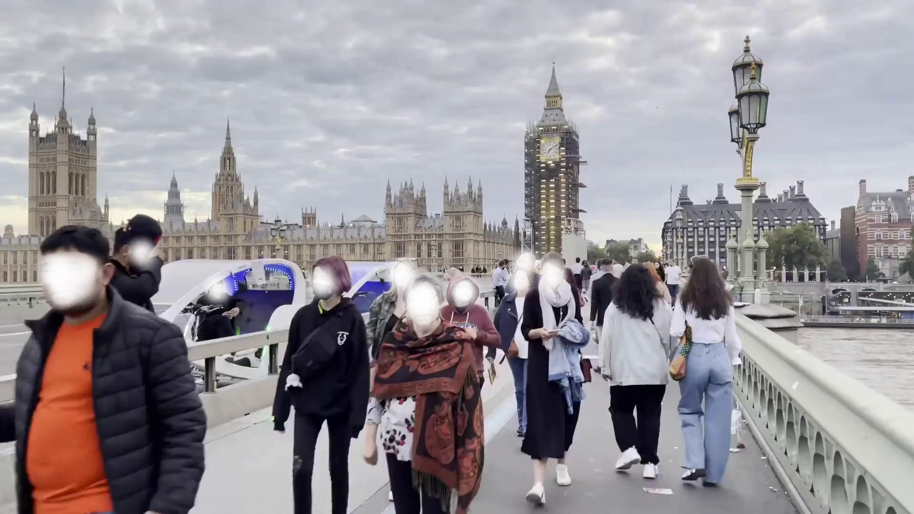

## 🌤 Sky Segmentation — Computer Vision Project
#### This project automatically segments the sky in a video and replaces it with a custom panoramic sky.
#### The system works with any video and sky texture and adapts the result based on camera motion and lighting.

## 🚀 Overview
### The system consists of the following stages:

1. Sky segmentation using a deep model (Mask2Former).

2. Sky mask refinement using morphology or CascadePSP (this module).

3. Sky projection adjustment to compensate for camera movement (optical flow).

4. Color matching and blending with the scene.

5. Video reconstruction from processed frames.

👤 My Contribution
I implemented the mask refinement module, which improves the raw binary masks by:
* Removing noise and small components.
* Smoothing edges using morphological operations.
* Optionally refining mask boundaries with CascadePSP.

**This step is critical for realistic sky replacement, especially around complex edges (trees, buildings, cables, etc.).**

**Original frame from video**

**Segmented mask**

**Refined mask**

## Results

### Input Video

### Output Video

## 🎯 How to Run
1. Clone the repository:
    git clone https://github.com/yourusername/sky-segmentation.git
    cd sky-segmentation

2. (Optional) Create and activate a virtual environment:
python -m venv venv
source venv/bin/activate        # On Windows: venv\Scripts\activate

3. Install the dependencies:
* If using uv (recommended for pyproject.toml):
uv pip install -r requirements.txt    # if using requirements.txt
or
uv pip install                        # if using pyproject.toml

* If using regular pip:
pip install -r requirements.txt      # for requirements.txt
or
pip install .                        # for pyproject.toml-based projects

4. Run the main script:
python main.py
or
uv run main.py